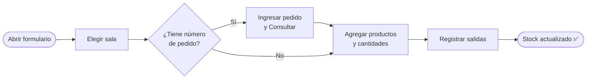

# 📤 Registrar salida manual

**Acceso:** Barra lateral → _Registrar salida_\
**Ruta:** `/inventory/exits/new`

Registrá manualmente que uno o más productos salieron de una sala. Se usa cuando la salida ocurre de forma directa —sin pasar por el sistema logístico— o cuando necesitás dejar constancia inmediata de algo que ya ocurrió físicamente.


Las salidas que llegan por **sincronización automática** no necesitan registrarse aquí — se gestionan en la pantalla de [Revisión de sync](08-revision-sync.md). Esta pantalla es solo para salidas **manuales**.


---

## Paso a paso



---

### 1. Parámetros

**Sala de origen** _(obligatorio)_\
Elegí la sala desde la cual salen los productos. Solo podés elegir una sala por operación. Si necesitás registrar salidas de dos salas distintas, completá el formulario dos veces.

**Número de pedido** _(opcional)_\
Si la salida está asociada a un pedido del sistema logístico:

1. Escribí el número en el campo.
2. Hacé clic en <kbd>Consultar</kbd>.
3. El sistema busca el pedido y muestra:
   * Nombre del cliente
   * Fecha del pedido
   * Productos y cantidades entregadas según el sistema logístico


La consulta del pedido es **informativa** — te ayuda a completar el formulario más rápido, pero los campos de la tabla los controlás vos. El sistema no completa nada automáticamente.


---

### 2. Productos a retirar

La tabla empieza con una fila vacía. Por cada producto que salió:

| Campo | Obligatorio | Descripción |
|-------|-------------|-------------|
| **Producto** | Sí | Seleccioná del menú desplegable |
| **Cantidad** | Sí | Número de unidades retiradas |
| **Notas** | No | Observación libre, ej. "Entregado en domicilio" |

<kbd>+ Agregar fila</kbd> — agrega otra fila para un producto adicional.\
<kbd>🗑</kbd> — elimina una fila (activo solo cuando hay más de una).

<details>

<summary>🆕 ¿El producto no existe todavía en el sistema?</summary>

Hacé clic en el botón **+** al lado del selector de producto. Se abre un formulario rápido:

```
┌────────────────────────────────────────┐
│  ➕ Crear nuevo producto               │
│                                        │
│  Nombre *         [________________]   │
│  Código interno * [________________]   │
│  Familia          [ — Sin familia — ]  │
│                                        │
│  [ Cancelar ]  [ Crear producto ]      │
└────────────────────────────────────────┘
```

Completá **Nombre** y **Código interno** (ambos obligatorios). La **Familia** es opcional.

Al hacer clic en <kbd>Crear producto</kbd>, el producto se crea en el sistema y queda seleccionado automáticamente en esa fila — sin perder lo que ya tenías cargado.

</details>

---

### 3. Confirmar

Hacé clic en <kbd>Registrar salidas</kbd>. El sistema descuenta las cantidades del stock de la sala seleccionada de **forma inmediata**.

---

## ¿Qué pasa si no hay suficiente stock?


Si un producto no tiene suficiente stock en esa sala, el sistema **registra la salida igualmente** — no bloquea la operación. Sin embargo, genera una **alerta de stock insuficiente** que aparecerá en la sección de [Alertas](09-alertas.md) para que puedas revisarla y resolverla.


Esto permite registrar la operación sin interrupciones, mientras dejás un registro de la discrepancia para revisarlo después.

---

## Corregir una salida ingresada por error

Si registraste una salida por error:

1. Andá a [Movimientos](02-movimientos.md).
2. Filtrá por tipo **Salida** y por el producto correspondiente.
3. Seleccioná el movimiento en la tabla.
4. Usá la acción **Eliminar** de la barra de acciones en lote.

El stock se recalcula automáticamente al eliminar el movimiento.
