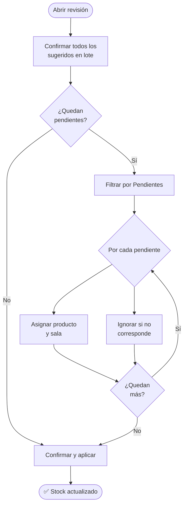

# 🔄 Revisión de sincronización

**Acceso:** Dashboard → botón <kbd>Revisar</kbd> en la tarjeta de syncs pendientes\
**Ruta:** `/inventory/syncs/:id`

Cuando el sistema importa movimientos —desde el sistema logístico o desde un Excel de carga masiva— no los aplica de inmediato. Los pone en un borrador para que los revises, corrijas lo necesario y luego confirmes. Esta pantalla es donde hacés esa revisión.

---

## Estados de los movimientos

Cada movimiento tiene un estado que el sistema asigna automáticamente según la información disponible:

<table data-full-width="true"><thead><tr><th width="140">Estado</th><th width="120">Color</th><th>Qué significa</th><th>Acción requerida</th></tr></thead><tbody><tr><td>🔵 <strong>Sugerido</strong></td><td>Borde azul</td><td>El sistema detectó automáticamente producto y sala. Listo para confirmar.</td><td>Revisar y confirmar</td></tr><tr><td>🟡 <strong>Sin asignar</strong></td><td>Borde amarillo</td><td>No se pudo detectar el producto o la sala. Necesita asignación manual.</td><td>Asignar y guardar</td></tr><tr><td>🟢 <strong>Confirmado</strong></td><td>Borde verde</td><td>Ya fue asignado y revisado. Listo para aplicar al stock.</td><td>Ninguna</td></tr><tr><td>⚫ <strong>Ignorado</strong></td><td>Gris, opaco</td><td>Decidiste no incluirlo. No afectará el stock.</td><td>Ninguna</td></tr></tbody></table>

---

## Flujo recomendado



---

## Encabezado de la pantalla

```
← Inventario / Revisión de sincronización

🔄 Revisión de sincronización
   01/06/2026 – 15/06/2026  ·  48 entregas  ·  63 movimientos

   [ ✓ Confirmar y aplicar ]    [ 🗑 Eliminar ]
```

* **Confirmar y aplicar** — aplica todos los movimientos confirmados al stock. Solo se activa cuando no quedan pendientes.
* **Eliminar** — descarta todo el borrador sin aplicar nada al stock.

---

## Aviso de productos detectados automáticamente

Si el sistema detectó productos en forma automática, aparece un banner azul al tope:

```
💡  12 movimiento(s) con producto detectado automáticamente —
    revisalos o confírmalos en lote.

    [ ✓ Confirmar todos los sugeridos (12) ]
```

Hacé clic en ese botón para aprobar todos los sugeridos de una sola vez. Después podés enfocarte en los que quedaron sin asignar.

---

## Filtros y búsqueda

La barra de filtros te permite enfocarte en un subconjunto:

| Filtro | Qué muestra |
|--------|-------------|
| **Todos** | Vista completa |
| **Pendientes** | Sugeridos + Sin asignar (los que necesitan atención) |
| **Sugeridos** | Detectados automáticamente, pendientes de confirmación |
| **Sin asignar** | Los que necesitás asignar manualmente |
| **Confirmados** | Los que ya están listos |
| **Ignorados** | Los que descartaste |

El buscador filtra por número de pedido o nombre de producto en tiempo real.

---

## Cómo está organizada la tabla

Los movimientos se agrupan por **número de pedido**. Cada grupo tiene un encabezado que indica el tipo de operación:



```
↓ Entrada  [ Sala Norte ]
15/06/2026  ·  PED-2-00123  ·  Cliente ABC
                              ✅ 2 pendiente(s)
```
Mercancía que llega a una sala.



```
↑ Salida  [ Sala Sur ]
15/06/2026  ·  PED-4-00456
                              ✅ Completo
```
Mercancía que sale de una sala.



```
↔ Transferencia  [ Sala Norte ] → [ Sala Sur ]
15/06/2026  ·  TRF-789
                              ⏳ 1 pendiente(s)
```
El mismo pedido tiene una salida de una sala y una entrada a otra.



---

## Acciones disponibles por estado



El sistema ya detectó producto y sala. Ves algo así:

```
💡 Sofá Oslo 3 puestos        Stock actual: 4
   ────────────────────────   Tras sync:    7
   [ ✓ Confirmar ]
```

Verificá que la asignación sea correcta y hacé clic en <kbd>Confirmar</kbd>.


Si **"Tras sync"** aparece en **rojo con número negativo**, significa que el movimiento dejaría el stock en negativo. El sistema no te bloquea, pero es una señal de que puede haber un error — revisá si el producto y la sala son correctos antes de confirmar.




Hay dos situaciones posibles:

**Sin sala y sin producto:**
```
[ — Sala — ]  [ — Producto — ]  [+]  [ ✓ Asignar ]
```

**Con sala pero sin producto:**
```
Sala Norte    [ — Producto — ]  [+]  [ ✓ Asignar ]
```

1. Si falta la **sala**: elegila en el primer selector.
2. Si falta el **producto**: elegilo en el segundo selector.
   * Si el producto no existe, el botón **+** abre el formulario de creación rápida.
3. Hacé clic en <kbd>Asignar</kbd>.



Cuando hay pendientes, aparece una barra de selección:

```
☐ Seleccionar pendientes visibles    0 seleccionado(s)
[ 📦 Asignar producto ]   [ 👁 Ignorar seleccionados ]
```

**Asignar producto en lote:**\
Abre un diálogo para asignar el mismo producto a todos los ítems seleccionados a la vez. Útil cuando varios movimientos de un mismo pedido corresponden al mismo artículo.

**Ignorar seleccionados:**\
Descarta los ítems seleccionados. No afectarán el stock al confirmar.



Cada fila sin resolver tiene un botón <kbd>👁</kbd> (ojo tachado) al final. Hacé clic para ignorar ese movimiento puntualmente.

El ítem queda en gris con el texto _"Ignorado"_. Podés ignorar todos los pendientes que no correspondan y después confirmar el sync.



---

## Confirmar la sincronización

Cuando el contador de **Pendientes** llega a 0, el botón <kbd>✓ Confirmar y aplicar</kbd> se activa.


Al confirmar:

* Todos los movimientos en estado **Confirmado** se aplican al stock de inmediato.
* Los movimientos **Ignorados** se descartan sin efecto.
* La sincronización desaparece de la lista de pendientes en el Dashboard.


---

## Eliminar la sincronización

Si querés descartar todo el borrador (por ejemplo, fue un sync erróneo o duplicado):

Hacé clic en <kbd>🗑 Eliminar</kbd> en el encabezado. El sistema pide confirmación y borra todos los movimientos del borrador sin aplicar nada al stock.


**Esta acción no se puede deshacer.** Si eliminás un sync por error, tenés que volver a sincronizar el rango de fechas correspondiente desde el Dashboard.


---

## Crear un producto rápido desde la revisión

Si un nombre recibido no corresponde a ningún producto existente:

1. Hacé clic en el botón **+** al lado del selector de producto.
2. Completá **Nombre** y **Código interno**.
3. Opcionalmente asigná una **Familia**.
4. Hacé clic en <kbd>Crear y seleccionar</kbd>.

El producto se crea y queda asignado automáticamente al movimiento que estabas editando.
