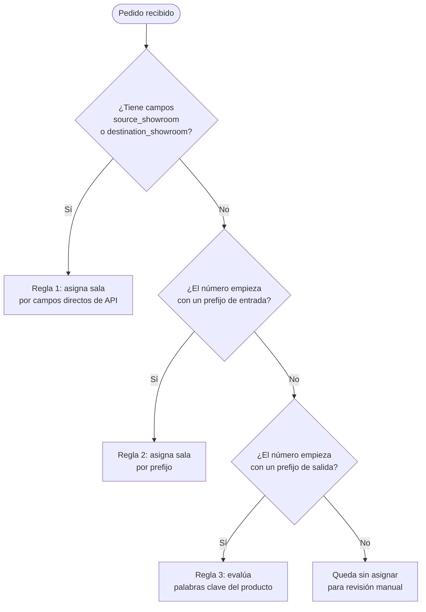

# ⚙️ Configuración de sincronización

**Acceso:** Barra lateral → _Configuración_ (sección Sincronización)\
**Ruta:** `/inventory/sync_config`


**Esta pantalla es para administradores del sistema.** Cambiar la configuración de prefijos o el sync automático afecta cómo se importan todos los movimientos de inventario. Si no estás seguro de qué estás cambiando, consultá con el responsable del sistema antes de guardar.


Controla cómo el sistema interpreta e importa los datos del sistema logístico externo. No es de uso cotidiano — se configura una vez y se ajusta cuando cambia algo en el sistema logístico o en la estructura de salas.

---

## Sección 1 — Reglas de prefijos por sala

Define qué número de pedido corresponde a cada sala (para detectar **Entradas**).

### Cómo funciona

Cuando llega un pedido del sistema logístico, el clasificador sigue estas reglas en orden:



### Tabla de salas

La tabla muestra cada sala con su nombre, código API y los prefijos configurados:

<table><thead><tr><th width="150">Columna</th><th>Descripción</th></tr></thead><tbody><tr><td><strong>Sala</strong></td><td>Nombre de la sala en el sistema</td></tr><tr><td><strong>Código API</strong></td><td>Identificador que usa el sistema logístico externo para esta sala</td></tr><tr><td><strong>Principal</strong></td><td>Si es la sala principal (referencia para clasificaciones ambiguas)</td></tr><tr><td><strong>Prefijos</strong></td><td>Campo editable con los prefijos de pedido, separados por coma</td></tr></tbody></table>

**Para modificar los prefijos de una sala:**
1. Editá el campo de texto (ej. `2-, 3-`).
2. Hacé clic en <kbd>✓ Guardar</kbd> en esa misma fila.

Cada sala tiene su propio botón de guardar — los cambios son independientes por sala.

---

## Sección 2 — Prefijos de pedidos de salida

Define qué números de pedido se interpretan como **Salidas** (pedidos de venta a clientes).

Cuando un pedido empieza con uno de estos prefijos, el sistema aplica la Regla 3: busca palabras clave del nombre del producto para determinar de qué sala sale.

**Para modificar:**
1. Editá el campo de texto (ej. `PED-4, PED-5`).
2. Hacé clic en <kbd>✓ Guardar</kbd>.


Las **palabras clave por sala** (usadas en Regla 3) se configuran en la ficha de cada sala, en la sección _Salas de exhibición_ (fuera de este módulo).

Si un producto tiene palabras clave que coinciden con más de una sala, el movimiento queda pendiente de asignación manual en la pantalla de [Revisión de sync](08-revision-sync.md).


---

## Sección 3 — Probar clasificación

Herramienta de diagnóstico que simula cómo el sistema clasificaría un pedido, **sin ejecutar nada real**.

<details>

<summary>¿Cómo usar la simulación?</summary>

Completá los campos que quieras probar:

| Campo | Cuándo completarlo |
|-------|--------------------|
| **Número de pedido** | Siempre (es el dato principal) |
| **Nombre del producto** | Para probar la Regla 3 (palabras clave) |
| **Sala de origen** | Para probar la Regla 1 (campos directos de API) |
| **Sala de destino** | Para probar la Regla 1 (campos directos de API) |

Hacé clic en <kbd>▶ Simular</kbd>. El resultado muestra:
- Qué regla se aplicó (1, 2 o 3)
- Qué sala y tipo de movimiento detectó
- Por qué no se pudo clasificar (si es el caso)

Útil para verificar que los prefijos están bien configurados antes de sincronizar datos reales.

</details>

---

## Sección 4 — Defaults del rango de fechas

Define los valores que aparecen precompletados en el formulario de sincronización manual del Dashboard.

| Campo | Qué hace |
|-------|---------|
| **Días hacia atrás** | La fecha _"Desde"_ se calcula restando este número de días a hoy |
| **Días hacia adelante** | La fecha _"Hasta"_ se calcula sumando este número (0 = hoy) |

Una vista previa debajo de los campos muestra el rango resultante con los valores actuales.

Hacé clic en <kbd>💾 Guardar defaults</kbd> para aplicar.

---

## Sección 5 — Sync automático programado

Permite que el sistema sincronice automáticamente sin intervención manual.


**Requiere Sidekiq + sidekiq-cron** activos en el servidor. Si no están disponibles, aparece un aviso debajo del botón de guardar. Contactá al equipo técnico para verificar.


### Opciones de configuración

<table><thead><tr><th width="250">Campo</th><th>Descripción</th></tr></thead><tbody><tr><td><strong>Activar sync automático</strong></td><td>Switch que enciende o apaga la sincronización automática</td></tr><tr><td><strong>Frecuencia</strong></td><td>Opciones predefinidas: diario a las 6am, diario a medianoche, cada lunes a las 6am, cada hora, o personalizado</td></tr><tr><td><strong>Expresión cron</strong></td><td>Solo editable si elegís "Personalizado". Formato estándar cron: <code>0 6 * * *</code></td></tr><tr><td><strong>Días a sincronizar</strong></td><td>Cuántos días hacia atrás se incluyen en cada ejecución automática</td></tr></tbody></table>

<details>

<summary>📖 Referencia rápida de expresiones cron</summary>

```
┌───────── minuto (0–59)
│ ┌─────── hora (0–23)
│ │ ┌───── día del mes (1–31)
│ │ │ ┌─── mes (1–12)
│ │ │ │ ┌─ día de la semana (0=dom, 1=lun ... 6=sáb)
│ │ │ │ │
0 6 * * *    → todos los días a las 6:00am
0 0 * * *    → todos los días a medianoche
0 6 * * 1    → todos los lunes a las 6:00am
0 * * * *    → cada hora en punto
0 6 * * 1-5  → lunes a viernes a las 6:00am
```

</details>

Hacé clic en <kbd>💾 Guardar configuración</kbd> para aplicar.


Aunque el sync automático esté activo, los movimientos importados siempre quedan como **pendientes** en el Dashboard hasta que alguien los revise y confirme manualmente. El sync automático solo trae los datos — la aprobación final siempre es manual.

