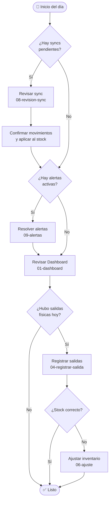

# 📦 Manual de Inventarios

Guía completa del módulo de inventarios. Explica cada pantalla, qué ves, qué podés hacer y cómo encaja en el flujo de trabajo diario.


**No necesitás conocimientos técnicos.** Este manual está escrito para los usuarios del sistema, no para desarrolladores.


---

## Conceptos clave

Antes de empezar, tres términos que aparecen en todo el módulo:

<table><thead><tr><th width="150">Término</th><th>Qué significa</th></tr></thead><tbody><tr><td><strong>Sala</strong></td><td>Un espacio físico donde se guarda o exhibe mercancía (ej. "Sala Norte", "Bodega"). Cada producto tiene stock independiente por sala.</td></tr><tr><td><strong>Movimiento</strong></td><td>Cualquier cambio en el inventario: entrada, salida o ajuste. Queda registrado con fecha, producto, sala y origen.</td></tr><tr><td><strong>Sync</strong></td><td>Importación automática de movimientos desde el sistema logístico externo. Antes de afectar el stock, los revisás y confirmás vos.</td></tr></tbody></table>

---

## Navegación del módulo

La barra lateral izquierda organiza todo en dos grupos:

### Operaciones — uso diario

| Pantalla | Para qué sirve |
|----------|---------------|
| [📊 Dashboard](01-dashboard.md) | Ver el stock actual de todos los productos por sala |
| [📋 Movimientos](02-movimientos.md) | Consultar el historial completo de entradas, salidas y ajustes |
| [📤 Registrar salida](04-registrar-salida.md) | Registrar que un producto salió físicamente de una sala |
| [📥 Stock inicial](05-stock-inicial.md) | Cargar el inventario de una sala por primera vez |
| [✏️ Ajustar inventario](06-ajuste.md) | Corregir cantidades tras un conteo físico |
| [📁 Carga masiva](07-carga-masiva.md) | Importar múltiples movimientos desde un archivo Excel |

### Sincronización — configuración

| Pantalla | Para qué sirve |
|----------|---------------|
| [⚙️ Configuración](10-configuracion.md) | Controlar cómo y cuándo se importan datos del sistema logístico |

### Siempre visible

| Pantalla | Para qué sirve |
|----------|---------------|
| [🔔 Alertas](09-alertas.md) | Ver discrepancias detectadas — aparece en **rojo** cuando hay alertas activas |

---

## Flujo de trabajo típico

---

## Tipos de movimiento

<table data-full-width="false"><thead><tr><th width="130">Tipo</th><th width="120">Color</th><th>Cuándo ocurre</th><th>Cómo se genera</th></tr></thead><tbody><tr><td>Entrada</td><td>🟢 Verde</td><td>Mercancía llega a una sala</td><td>Sync o carga masiva</td></tr><tr><td>Salida</td><td>🔴 Rojo</td><td>Mercancía sale de una sala</td><td>Manual o sync</td></tr><tr><td>Stock inicial</td><td>🔵 Azul</td><td>Primer inventario de una sala</td><td>Manual</td></tr><tr><td>Ajuste</td><td>⚪ Gris</td><td>Corrección tras conteo físico</td><td>Manual</td></tr></tbody></table>

---

## Secciones de este manual

1. [Dashboard — Stock de inventario](01-dashboard.md)
2. [Movimientos — Historial](02-movimientos.md)
3. [Stock por sala](03-stock-por-sala.md)
4. [Registrar salida manual](04-registrar-salida.md)
5. [Cargar stock inicial](05-stock-inicial.md)
6. [Ajustar inventario](06-ajuste.md)
7. [Carga masiva por Excel](07-carga-masiva.md)
8. [Revisión de sincronización](08-revision-sync.md)
9. [Alertas de inventario](09-alertas.md)
10. [Configuración de sincronización](10-configuracion.md)
